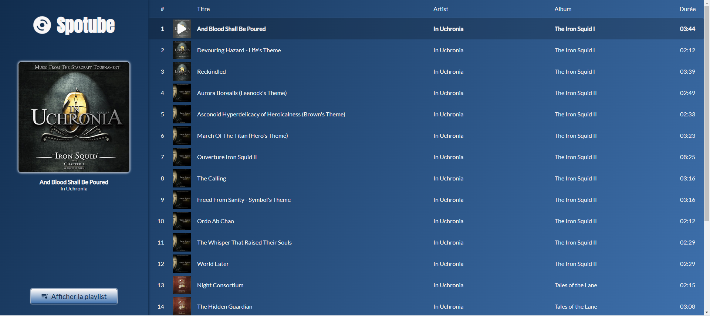
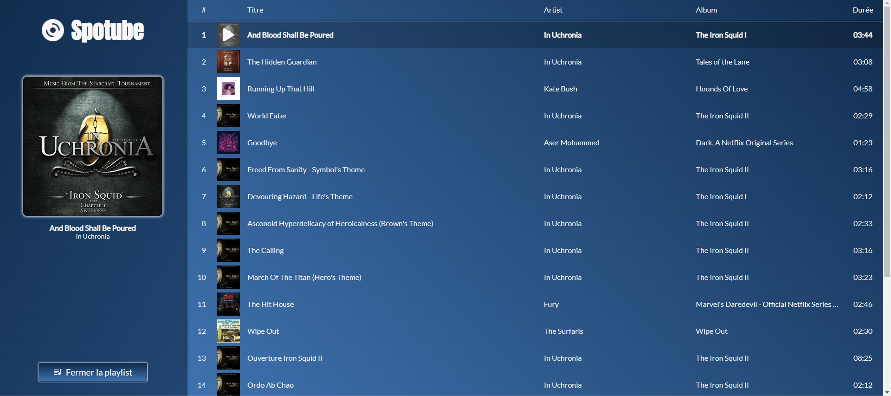

# Spotube

> Spotube est une application de streaming musical qui te donne accès à quelques titres. 

  

## Contexte du projet

L'application a été réalisé dans le cadre d'un concours : Intégrer une page avec un lecteur audio/vidéo.

Plus d'informations ici : [discord du Repaire du Web](https://discord.com/channels/655077317911117860/1041772720066674760/1087289852095119440).

## Outils utilisés

Ce projet a été réalisé à l'aide de la bibliothèque ``SolidJS``, en ``typescript``. Pour le style, j'ai utilisé à ``sass`` avec les ``modules css``. Pour la constuction, j'ai eu recours à ``Vite``.

## Description de l'application

La projet réalisé est donc une application de streaming musical, utilisant plusieurs titres de musique.

En premier lieu, voici la vue de l'application. A gauche se trouve la sidebar avec la cover de l'album, le titre et l'artiste, ainsi qu'un bouton pour afficher ou non la playlist.
A droite se trouve la liste de lecture. Il est possible de cliquer sur un titre pour démarrer l'écoute. Un bouton ``lecture``/``pause`` est aussi présent sur la cover de la sidebar et sur la cover du titre en cours. 

A ceci, un ensemble de contrôles, un lecteur et des fonctionnalités sont disponible dans le bas de l'écran.

### Liste des contrôles

- **Précédent** : Met la musique précédente à partir de la liste de lecture. Si c'est le premier titre, le bouton est désactivé.
- **Suivant** : Met la musique suivante à partir de la liste de lecture. Si c'est le dernier titre, le bouton est désactivé.
- **Lecture/Pause** : Alterne entre la lecture et la pause du titre en cours de lecture.

### Lecteur

- **Titre et artiste** : Titre de la musique et artiste du titre en cours de lecture
- **Timer** : Temps actuel de la lecture audio
- **Barre de lecture** : Affiche la progression de la lecture du titre. Il est aussi possible de cliquer sur celle ci pour mettre à jour la progression.
- **Temps restant** : Affiche la durée totale du titre en cours. Il est également possible de cliquer dessus pour affiche le temps restant jusqu'à la fin du titre

### Fonctionnalités

- **Repeat** : Le bouton repeat permet d'alterner entre 3 modes :
  - **Repeat off** : Désactive le mode repeat ;
  - **Repeat one** : Permet de répéter un titre (en cliquant sur le bouton suivant, cette option est ignorée) ;
  - **Repeat all** : Permet de répéter la liste de lecture.
- **Liste de lecture** : La liste de lecture affiche tous les titres. L'ordre de lecture des titres se réfère à la liste de lecture.
- **Mode aléatoire** : Le bouton permet d'active ou non le mode aléatoire. Activer le mode aléatoire génère la liste de lecture de façon aléatoire. Tous les titres seront écoutés une seule fois. Désactiver le mode remet les titres dans l'ordre de base. Réactiver à nouveau le mode génèrera un nouvel ordre de lecture.
- **Muet** : Le bouton permet d'activer ou non le son. Réactiver le son remet le son au volume auquel il était.
- **Barre de volume** : Modifier le volume de la lecture. Si le nouveau son n'est pas 0, l'option muet est désactivée.

Les réglages sont enregistrés dans le localStorage afin d'améliorer le confort de l'utilisateur.